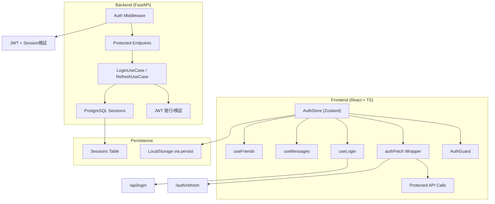
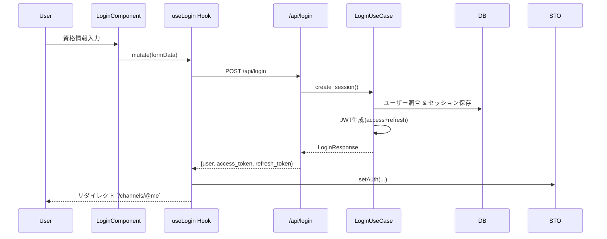
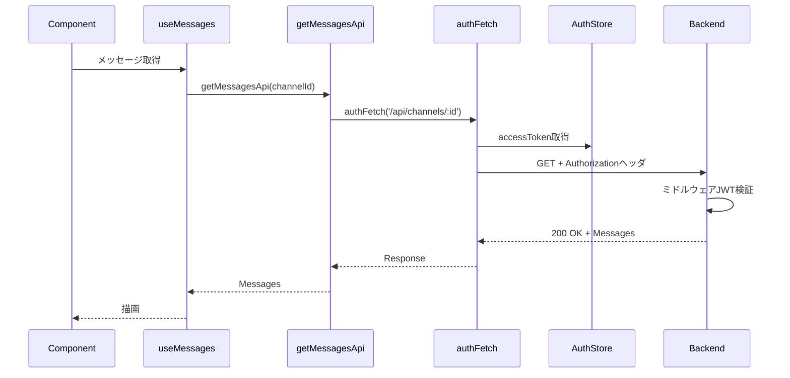
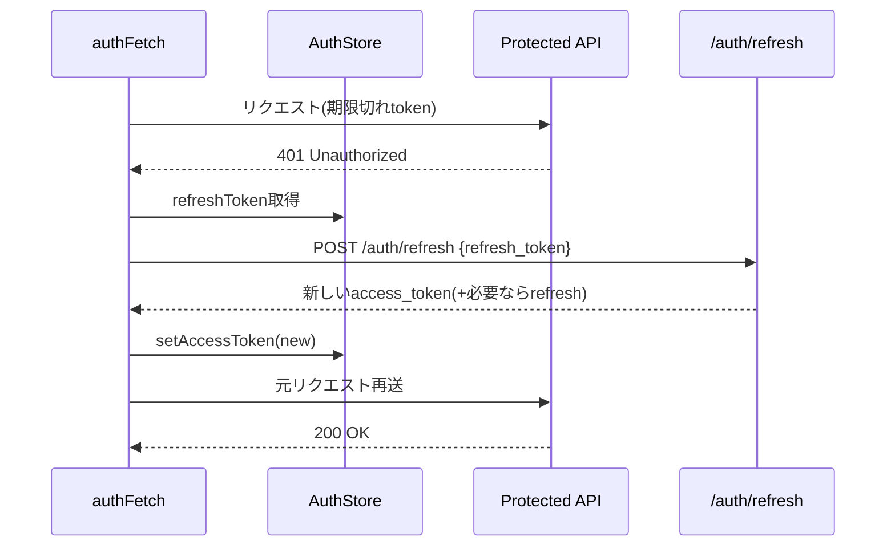
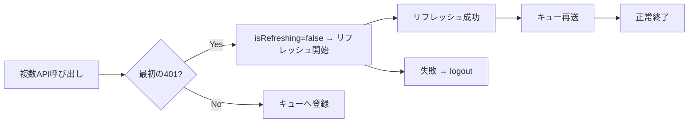
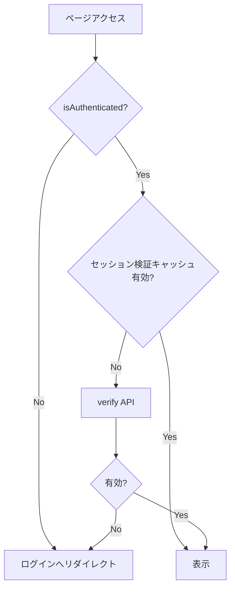
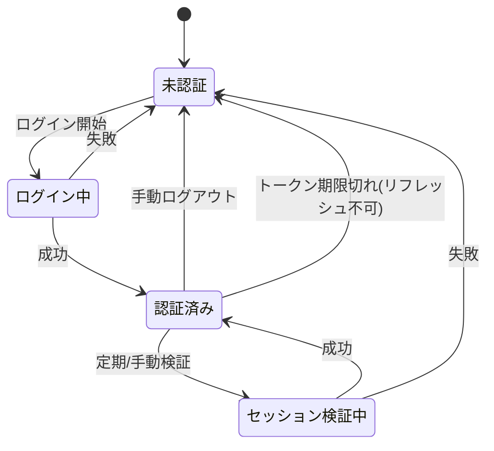
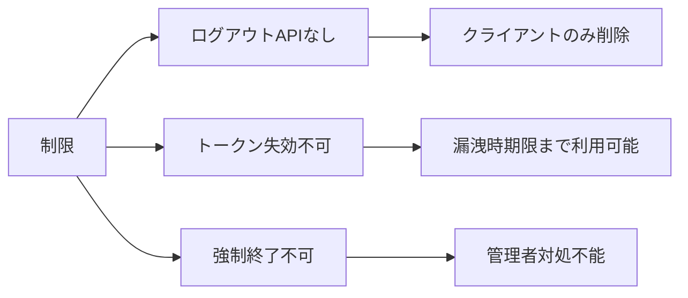

# 認証システム統合ドキュメント (Unified Auth Documentation)

## 1. 概要

Discord 風チャットアプリの認証は **JWT アクセストークン + リフレッシュトークン + DB セッション** を組み合わせ、ユーザビリティとセキュリティのバランスを取っています。アクセストークンは短期（15 分）、リフレッシュトークンは長期（7 日）で、期限切れ時はフロントエンドが自動リフレッシュを行い透過的に継続利用できます。

### 主要特徴

- 自動トークンリフレッシュ（401 検知で再取得 & リトライ）
- 同時 401 発生時は 1 回のみリフレッシュ + キュー処理
- Zustand + persist によるクライアント側状態管理
- FastAPI ミドルウェアによる一括認証検証
- DB セッション保存 + 今後トークン失効/ブラックリスト拡張余地

## 2. 全体アーキテクチャ



## 3. トークンモデルと有効期限

| 種類                 | 用途                       | 有効期限 | 保存場所        | ローテーション         | 備考                           |
| -------------------- | -------------------------- | -------- | --------------- | ---------------------- | ------------------------------ |
| アクセストークン     | API 認証                   | 15 分    | Zustand persist | 期限切れ時のみ再発行   | ヘッダ `Authorization: Bearer` |
| リフレッシュトークン | 新しいアクセストークン取得 | 7 日     | Zustand persist | 今後ローテーション予定 | `/auth/refresh` 送信           |

今後の改善予定:

1. 有効期限事前チェック & 期限接近時の自動更新
2. リフレッシュトークンローテーション（ワンタイム性）
3. トークン失効 (Blacklist) で強制ログアウト可能に

## 4. データベーススキーマ（抜粋）

### Users

| カラム        | 型           | 説明            |
| ------------- | ------------ | --------------- |
| id            | UUID         | 主キー          |
| username      | VARCHAR(50)  | 一意ユーザー名  |
| name          | VARCHAR(100) | 表示名          |
| password_hash | VARCHAR(255) | bcrypt ハッシュ |
| created_at    | TIMESTAMP    | 作成日時        |
| updated_at    | TIMESTAMP    | 更新日時        |

### Sessions (現状と改善予定)

| カラム                   | 型             | 説明                                                           |
| ------------------------ | -------------- | -------------------------------------------------------------- |
| id                       | UUID           | 主キー                                                         |
| user_id                  | UUID           | Users 外部キー                                                 |
| access_token_hash        | TEXT           | 現状 refresh_token_hash として扱われている命名不整合を修正予定 |
| refresh_token_hash       | TEXT           | 今後導入時に追加（未実装/計画）                                |
| access_token_expires_at  | TIMESTAMP      | アクセストークン期限                                           |
| refresh_token_expires_at | TIMESTAMP      | リフレッシュトークン期限                                       |
| user_agent               | TEXT           | UA 情報                                                        |
| ip_address               | INET           | IP アドレス                                                    |
| created_at               | TIMESTAMP      | 作成日時                                                       |
| revoked_at               | TIMESTAMP NULL | 失効日時（計画）                                               |

### TokenBlacklist (計画)

| カラム     | 型        | 説明                   |
| ---------- | --------- | ---------------------- |
| id         | UUID      | 主キー                 |
| token_hash | TEXT      | 失効済み JWT ハッシュ  |
| revoked_at | TIMESTAMP | 失効登録日時           |
| expires_at | TIMESTAMP | 本来のトークン有効期限 |

## 5. フロントエンド構成

| ファイル                                      | 役割                                                                                  |
| --------------------------------------------- | ------------------------------------------------------------------------------------- |
| `stores/authStore.ts`                         | 認証状態管理（user / accessToken / refreshToken / setAuth / setAccessToken / logout） |
| `utils/authFetch.ts`                          | 認証付き fetch ラッパー + リフレッシュ制御 + キュー処理                               |
| `api/auth.ts`                                 | `loginApi`, `refreshTokenApi`                                                         |
| `api/message.ts` / `api/friend.ts`            | 認証が必要な各ドメイン API（内部で `authFetch` 利用）                                 |
| `hooks/useLogin.ts`                           | ログイン処理 & トークン保存                                                           |
| `hooks/useMessages.ts`, `hooks/useFriends.ts` | データ取得用 React Query フック                                                       |
| `components/AuthGuard.tsx`                    | ルート保護 & 未認証リダイレクト                                                       |

### 認証ストアインターフェース（抜粋）

```typescript
interface AuthState {
  isAuthenticated: boolean;
  user: User | null;
  accessToken: string | null;
  refreshToken: string | null;
  setAuth: (user: User, access: string, refresh: string) => void;
  setAccessToken: (access: string) => void;
  logout: () => void;
}
```

## 6. バックエンド構成

| ファイル                           | 役割                                                                                                          |
| ---------------------------------- | ------------------------------------------------------------------------------------------------------------- |
| `middleware.py`                    | 認証ミドルウェア（除外パス判定 + JWT 検証 + User 付与）                                                       |
| `api/login.py`                     | ログインエンドポイント `/api/login`                                                                           |
| `api/auth.py`                      | リフレッシュ `/auth/refresh`（実装済）/ 今後 `/api/logout` 追加予定                                           |
| `usecase/login.py`                 | 認証ロジック (create_session, auth_session)                                                                   |
| `repository/session_repository.py` | セッション永続化                                                                                              |
| `utils/utils.py`                   | JWT 生成・検証 (`create_access_token`, `verify_access_token`, `create_refresh_token`, `verify_refresh_token`) |

### ミドルウェア認証フロー（簡略）

```python
async def auth_session(req: Request, call_next):
  if req.method == 'OPTIONS' or req.url.path in ['/api/login','/api/user','/docs','/openapi.json','/auth/refresh']:
      return await call_next(req)
  token = extract_bearer(req.headers)
  payload = verify_access_token(token)
  if not payload:
      return JSONResponse(status_code=401, content={"detail": "認証が必要です"})
  user = await user_repo.get_user_by_username(session, payload['sub'])
  if not user:
      return JSONResponse(status_code=401, content={"detail": "認証が必要です"})
  req.state.user = user
  return await call_next(req)
```

## 7. 認証フロー詳細

### 7.1 ログイン



### 7.2 認証付き API（成功ケース）



### 7.3 トークンリフレッシュ（401 発生時）



### 7.4 同時リクエスト 401 処理



### 7.5 認証ガード



### 7.6 状態遷移



## 8. API エンドポイント一覧

| エンドポイント  | メソッド | 認証                       | 説明                 | 状態        |
| --------------- | -------- | -------------------------- | -------------------- | ----------- |
| `/api/login`    | POST     | 不要                       | ログイン             | 運用中      |
| `/api/user`     | POST     | 不要                       | ユーザー登録         | 運用中      |
| `/auth/refresh` | POST     | 不要(リフレッシュトークン) | トークン再発行       | 運用中      |
| `/api/logout`   | POST     | 要                         | サーバー側ログアウト | 計画        |
| `/auth/verify`  | GET      | 要                         | セッション検証       | 計画/整理中 |

### 認証除外パス

`/api/login`, `/api/user`, `/auth/refresh`, `/docs`, `/openapi.json`, `OPTIONS` メソッド

## 9. エラーハンドリング規約

| ケース                   | レスポンス例                        | クライアント挙動                 |
| ------------------------ | ----------------------------------- | -------------------------------- |
| アクセストークン期限切れ | 401 {"detail":"認証が必要です"}     | authFetch が自動リフレッシュ試行 |
| リフレッシュ失敗         | 401 / 400                           | logout() → ログイン画面へ        |
| ネットワーク障害         | fetch 例外                          | 呼び出し側で再試行/通知          |
| 不正資格情報             | 401 {"detail":"認証に失敗しました"} | フォームにエラー表示             |

統一形式: `{ "detail": <人が読める説明> }` （将来: `code`, `timestamp` 追加予定）

## 10. セキュリティ対策と残存課題

### 実装済み

- bcrypt パスワードハッシュ
- JWT 署名検証 HS256 + 有効期限
- DB セッション保持 (IP / UserAgent)
- CORS 制御
- 自動ログアウト（リフレッシュ失敗時）

### 未実装/課題

| 項目                    | 状態   | 優先度 | 説明                           |
| ----------------------- | ------ | ------ | ------------------------------ |
| ログアウト API          | 未実装 | 高     | サーバー側でセッション失効     |
| トークンブラックリスト  | 未実装 | 高     | トークン強制失効手段           |
| 強制ログアウト (管理者) | 未実装 | 中     | 不正利用時遮断                 |
| トークンローテーション  | 未実装 | 中     | リフレッシュトークン再利用防止 |
| レート制限              | 未実装 | 中     | ログイン試行防御               |
| 2 要素認証              | 未実装 | 低     | 追加認証層                     |
| セッション管理 UI       | 未実装 | 中     | 自分のセッション一覧閲覧/失効  |

## 11. 改善ロードマップ

### Phase 1 (即時 ~ 1 週)

- `/api/logout` 実装
- ブラックリストテーブル & 検証導入
- エラーレスポンス拡張 (`code`, `timestamp`)

### Phase 2 (2~3 週)

- リフレッシュトークンローテーション
- 強制ログアウト / 管理 UI 下地
- レート制限 (Login, Refresh)

### Phase 3 (1~2 ヶ月)

- 2 要素認証(TOTP/SMS)
- セキュリティ監査ログ
- 異常検知 (連続失敗/地理 IP 変動)

## 12. 既知の制限事項



短期対策: アクセストークン短期化 / 監査ログ追加予定。

## 13. テスト戦略サマリ

### フロントエンド

- ログイン成功/失敗
- authFetch リフレッシュ成功/失敗
- AuthGuard 未認証リダイレクト

### バックエンド

- `/api/login` 正常/資格情報不正
- JWT 検証: 有効/期限切れ/改ざん
- `/auth/refresh` 成功/リフレッシュ不正
- ミドルウェア除外パス挙動

## 14. 用語集

用語は初出時は日本語+英語併記し、その後は日本語のみを基本とし曖昧さ回避が必要な場合に英語を括弧補足します。

| 用語                 | 英語            | 定義 / 運用指針                                                                               |
| -------------------- | --------------- | --------------------------------------------------------------------------------------------- |
| アクセストークン     | Access Token    | 短期 JWT。API 呼び出し毎に `Authorization: Bearer` 送信。期限切れ時はリフレッシュ処理へ移行。 |
| リフレッシュトークン | Refresh Token   | 長期 JWT。アクセストークン再発行専用。ローテーション/失効管理は Phase2 以降導入予定。         |
| セッション           | Session         | DB に保存する認証状態レコード。IP / UserAgent / 有効期限を保持。将来 `revoked_at` 追加予定。  |
| ブラックリスト       | Token Blacklist | 失効済みトークンハッシュ一覧。認証時照合し即拒否（未実装）。                                  |
| ローテーション       | Rotation        | リフレッシュトークン再利用防止のため再発行 + 旧トークン失効。Phase2 後半予定。                |
| 認証ガード           | AuthGuard       | 画面遷移時に認証状態・検証キャッシュを判定し表示/リダイレクト制御。                           |
| 認証付きフェッチ     | authFetch       | 401 検知で自動リフレッシュ再試行。並列 401 はキュー化。非認証エンドポイントでは利用禁止。     |
| 失効                 | Revoke          | トークンを強制的に無効化しブラックリスト登録またはセッション `revoked_at` を設定（未実装）。  |
| 有効期限接近         | Expiration Near | 事前更新のトリガー条件（残り <2 分など閾値設定予定）。                                        |
| バージョン履歴       | Version History | 本ファイル末尾の変更記録。仕様・設計変更時に必ず行追加。                                      |

## 15. 統合後の運用方針

1. 変更が発生したら本ファイルを直接更新
2. 大幅改修時はバージョンヘッダを追記（例: `v1.2 (2025/11/12)`）
3. 旧ドキュメントは削除予定（まずは参照停止アナウンス）

## バージョン履歴

| バージョン | 日付       | 変更概要                                         |
| ---------- | ---------- | ------------------------------------------------ |
| v1.0       | 2025/11/12 | 初版統合 (4 ファイル集約)                        |
| v1.0.1     | 2025/11/12 | 用語集拡充・用語統一方針追加・旧ファイル削除明記 |

---

**最終更新**: 2025/11/12  
**作成者**: 認証システム統合タスク  
今後の更新は本ファイルのみ対象。疑問点や改善案は Issue へ。
