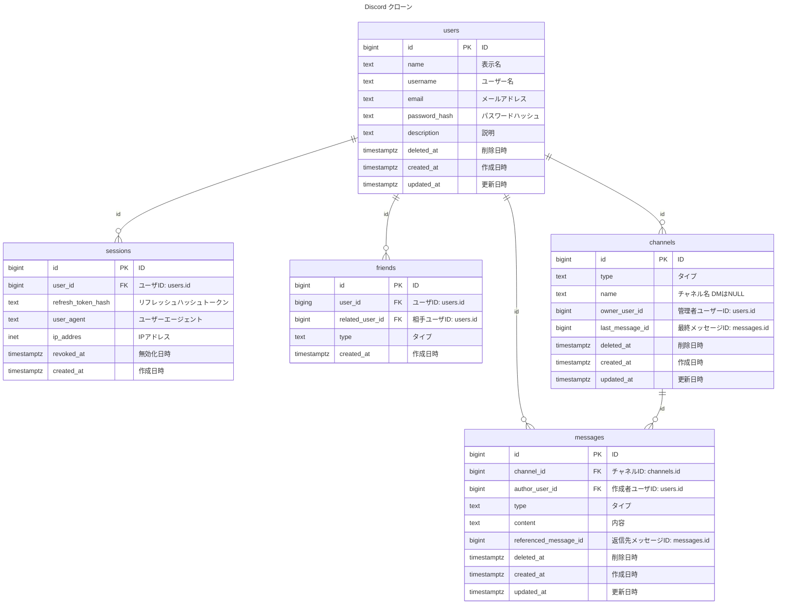

# ER図

```mermaid
---
title: "Discord クローン"
---
erDiagram
    users ||--o{ sessions : "id"
    users ||--o{ friends : "id"
    users ||--o{ channels : "id"
    users ||--o{ messages : "id"
    channels ||--o{ messages : "id"

    users {
        bigint id PK "ID"
        text name "表示名"
        text username "ユーザー名"
        text email "メールアドレス"
        text password_hash "パスワードハッシュ"
        %% text avatar_url "アバターURL"
        text description "説明"
        timestamptz deleted_at "削除日時"
        timestamptz created_at "作成日時"
        timestamptz updated_at "更新日時"
    }

    sessions {
        bigint id PK "ID"
        bigint user_id FK "ユーザID: users.id"
        text refresh_token_hash  "リフレッシュハッシュトークン <UNIQUE NOT NULL>"
        text user_agent "ユーザーエージェント"
        inet ip_addres "IPアドレス"
        timestamptz revoked_at "無効化日時"
        timestamptz created_at "作成日時"
    }

    friends {
        bigint id PK "ID"
        biging user_id FK "ユーザID: users.id"
        bigint related_user_id FK "相手ユーザID: users.id"
        text type "タイプ"
        timestamptz created_at "作成日時"
    }

    channels {
        bigint id PK "ID"
        %% bigint guild_id "サーバーID DMはNULL: guilds.id"
        text type "タイプ"
        text name "チャネル名 DMはNULL"
        bigint owner_user_id "管理者ユーザーID: users.id"
        bigint last_message_id "最終メッセージID: messages.id"
        timestamptz deleted_at "削除日時"
        timestamptz created_at "作成日時"
        timestamptz updated_at "更新日時"
    }

    messages {
        bigint id PK "ID"
        bigint channel_id FK "チャネルID: channels.id <DELETE CASCADE>"
        bigint author_user_id FK "作成者ユーザID: users.id"
        text type "タイプ"
        text content "内容"
        bigint referenced_message_id "返信先メッセージID: messages.id"
        timestamptz deleted_at "削除日時"
        timestamptz created_at "作成日時"
        timestamptz updated_at "更新日時"
    }

    %% guilds {
    %%     bigint id PK "ID"
    %%     bigint owner_user_id FK "管理者ユーザID: users.id"
    %%     text name "サーバー名"
    %%     %% text icon_url "アイコンURL"
    %% }
```
